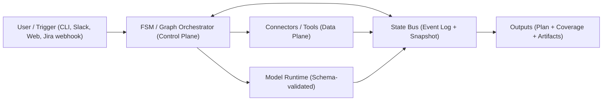
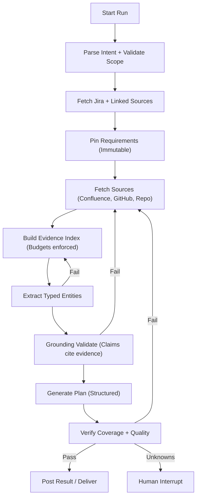
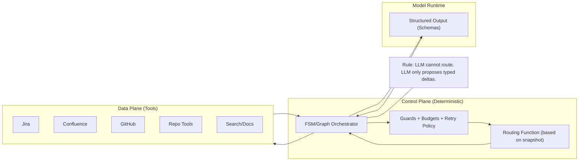
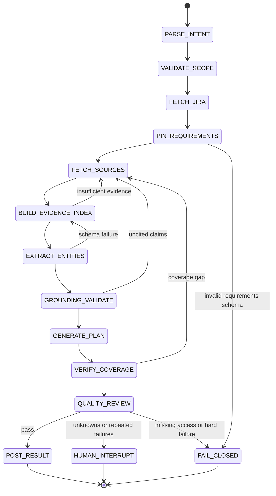
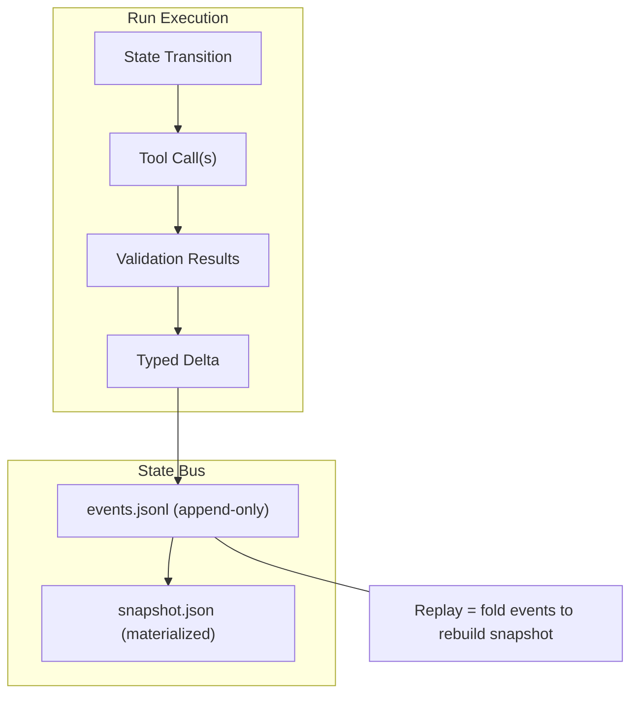
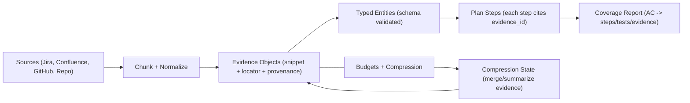
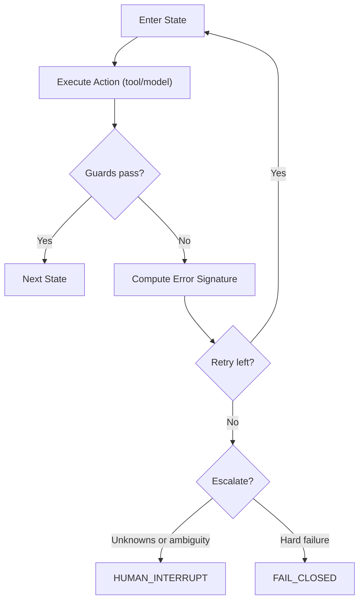

# Architecture

---

Interlock is a deterministic orchestration layer for resolving Jira tickets with AI. It compiles messy ticket context (Jira, Confluence, GitHub, repo files) into a **traceable, validated intermediate representation** (IR), then produces a **grounded plan** that can be posted back to Jira.

This document defines the architecture of:

- the **FSM/Graph orchestrator** (control plane)
- the **State Bus** (event-sourced state + immutable/pinned requirements)
- the **evidence-first context layer**
- the **validation + governance** gates that make the system reliable



---

## **Architecture Principles**

### **Determinism over improvisation**

- The orchestrator decides *what happens next*.
- The model proposes **typed deltas** and structured outputs.
- Tool selection, retries, and stopping conditions are deterministic.

### **Evidence-first, not dump-first**

- Raw documents are not the unit of reasoning.
- The unit is an **evidence object**: small snippet + provenance + locator.

### **Grounded outputs**

- Any actionable claim (plan step, file path, version assumption) must cite **evidence IDs** or be marked as an explicit assumption.

### **Drift resistance**

- Requirements are **pinned** early and never overwritten.
- Later steps must prove coverage against pinned requirements.

### **Replayability & auditability**

- Everything that happens is written as events (tool calls, validations, deltas).
- Runs can be replayed and debugged deterministically.



---

## **Components**

1. **Client / Trigger**
    - CLI, Slack bot, web UI, or Jira webhook that starts a run.
2. **FSM / Graph Orchestrator (Control Plane)**
    - Executes a finite set of states (nodes).
    - Applies guards, budgets, retry policy, and interrupts.
3. **Connectors / Tools (Data Plane)**
    - Jira, Confluence, GitHub, repo access, search, build/test tools.
    - Ideally exposed through MCP-style interfaces.
4. **State Bus**
    - Event log (append-only) + materialized snapshot.
    - Includes pinned requirements, working evidence/entities, governance counters.
5. **Model Runtime**
    - LLM calls are bounded, schema-validated, and never used for routing.

```mermaid
flowchart LR
  U[User / Trigger<br/>(CLI / Slack / Web / Jira webhook)] --> O[FSM / Graph Orchestrator<br/>(Control Plane)]

  O <--> SB[State Bus<br/>Event Log + Snapshot]
  O --> M[Model Runtime<br/>(Schema-validated calls)]
  O --> T[Connectors / Tools<br/>(Data Plane: Jira/Confluence/GitHub/Repo/Search)]

  T --> SB
  M --> SB

  SB --> OUT[Outputs<br/>Plan + Coverage + Artifacts<br/>(Post to Jira or Interrupt)]
```

---

## **Data Flow**

1. User input resolves to a ticket/run scope.
2. Interlock fetches ticket context + linked sources.
3. Raw sources are converted into **evidence objects** under strict budgets.
4. Typed entities + requirements are extracted and validated.
5. A plan is generated as a **structured object**, grounded in evidence.
6. Coverage and quality checks pass → output is posted (or paused for review).



---

## **Routing rule**

- LLM never decides “what tool next.”
- Routing is computed from snapshot state:
    - missing pinned requirements → PIN_REQUIREMENTS
    - insufficient evidence → FETCH_SOURCES / BUILD_EVIDENCE_INDEX
    - validation failure → remediation state
    - repeated failure signature → HUMAN_INTERRUPT or FAIL_CLOSED

---

## **FSM / Graph States**

### **Phase A - Pin and Gather**

**PARSE_INTENT**

- Extract ticket identifier, repo scope, and user goal.

**VALIDATE_SCOPE**

- Confirm ticket exists, access is available, required connectors reachable.

**FETCH_JIRA**

- Pull issue description, comments, attachments metadata, linked pages/PRs.

**PIN_REQUIREMENTS**

- Extract and validate:
    - problem statement
    - acceptance criteria
    - constraints
    - definition of done
- Output goes into **pinned** state (immutable).

**Guard to proceed:** acceptance criteria exist and schema validates.

### **Phase B - Compile Evidence**

**FETCH_SOURCES**

- Retrieve linked Confluence pages, PR discussions, referenced docs, repo areas.

**BUILD_EVIDENCE_INDEX**

- Chunk sources into evidence objects:
    - snippet
    - locator (url+anchor or file+line range)
    - source_id
    - tags
    - token estimates
- Enforce budgets (see Governance section).

**EXTRACT_ENTITIES**

- Produce typed entities needed for planning:
    - components/services
    - APIs/contracts
    - error messages / stack traces
    - file paths / modules
    - version constraints

**Guard to proceed:** evidence within budget and entities validate.

### **Phase C - Verify and Plan**

**GROUNDING_VALIDATE**

- Enforce grounding contract:
    - any claim must cite evidence IDs
    - uncited items must be explicit assumptions
- Optionally verify:
    - referenced repo paths exist
    - mentioned dependency versions exist in evidence or tooling output

**GENERATE_PLAN**

- Produce a structured plan object:
    - steps with dependencies
    - files touched
    - evidence IDs per step
    - risks/unknowns
    - suggested validation/tests

**VERIFY_COVERAGE**

- Map each acceptance criterion to:
    - plan steps
    - validation/test steps
    - supporting evidence
- Failing coverage routes back deterministically.

**QUALITY_REVIEW**

- Score plan quality + completeness using rubric-based checks.

### **Phase D - Deliver**

**POST_RESULT**

- Post plan back to Jira (or generate PR checklist, etc.).
- Should be gated behind passing validation + quality threshold.

**HUMAN_INTERRUPT**

- Triggered when:
    - unknowns remain after max search rounds
    - repeated error signatures
    - low confidence / ambiguous requirements

**FAIL_CLOSED**

- Deterministic stop with:
    - what was found
    - what failed
    - what’s missing
    - recommended next actions



---

## **State Bus**

### **Snapshot model (conceptual)**

The snapshot is split into **pinned**, **working**, and **governance**.

**Pinned (immutable after validated)**

- ticket_id
- problem_statement**Phase A - Pin and Gather**
    
    **PARSE_INTENT**
    
    - Extract ticket identifier, repo scope, and user goal.
    
    **VALIDATE_SCOPE**
    
    - Confirm ticket exists, access is available, required connectors reachable.
    
    **FETCH_JIRA**
    
    - Pull issue description, comments, attachments metadata, linked pages/PRs.
    
    **PIN_REQUIREMENTS**
    
    - Extract and validate:
        - problem statement
        - acceptance criteria
        - constraints
        - definition of done
    - Output goes into **pinned** state (immutable).
    
    **Guard to proceed:** acceptance criteria exist and schema validates.
    

**Working (mutable)**

- sources[]
- evidence[]
- entities (typed)
- plan (structured)
- coverage report
- scores
- open_unknowns[]
- assumptions[]

**Governance**

- budgets
- retry counters per state
- search rounds
- last error signatures
- run metadata

### **Event log (append-only)**

Each state transition appends an event:

- state name
- timestamp
- tool calls (args hash + result hash)
- validation results
- deltas applied to snapshot
- error signature (if failed)

**Why event sourcing**

- deterministic replay
- “why did it do this?” debugging
- audit trail for tool calls + reasoning artifacts



---

## **Evidence Layer**

### **Source vs Evidence**

**Source**

- full document (Jira description, Confluence page, PR thread, file, etc.)
- stored as metadata + reference (not always persisted fully)

**Evidence**

- minimal snippet required for reasoning
- includes provenance and location

### **Evidence object (recommended fields)**

- evidence_id
- source_id
- locator (url+anchor OR path+line_range)
- snippet
- tokens_estimate
- tags (e.g., “api_contract”, “error”, “version”)

### **Evidence budgets**

Budgets are enforced as guards, not guidelines:

- max evidence items
- max evidence tokens
- max sources per type
- max search rounds

If exceeded:

- route to a **compression** step (summarize / merge evidence) instead of expanding context.



---

## **Validation Layer**

### **1) Schema validation**

All key artifacts are schema-validated (Pydantic style):

- requirements extraction
- entity extraction
- plan object
- coverage report

Invalid schema → deterministic remediation path.

### **2) Grounding contract**

Rules:

- Plan steps must cite evidence IDs.
- Any uncited item must be explicitly marked as an assumption.
- Unknowns must be listed and either resolved or routed to interrupt.

### **3) Requirement coverage**

Every acceptance criterion must map to:

- at least one plan step
- at least one validation/test step
- evidence IDs supporting the approach

Coverage < threshold → back to FETCH_SOURCES / BUILD_EVIDENCE_INDEX / EXTRACT_ENTITIES.

### **4) Repo sanity checks (optional but high value)**

- referenced file paths exist
- mentioned packages appear in dependency files
- commands suggested are valid for the repo tooling

---

## **Governance: Retries, Budgets, and Stopping**

### **Deterministic retry policy**

Track:

- retry_count[state]
- last_error_signature

Rules:

- max retries per state (e.g., 2)
- if the same error signature repeats → HUMAN_INTERRUPT or FAIL_CLOSED
- no unbounded loops

### **Stopping conditions**

- coverage achieved + validations pass + quality threshold met → deliver
- missing access / missing critical sources after search rounds → interrupt/fail-closed



---

## **Observability & Debugging**

### **Metrics**

- tool latency per connector
- token usage per state
- evidence item counts and compression rate
- validation pass/fail rates
- retry counts + error signatures

### **Traceability artifacts**

- event log per run
- materialized snapshot at each checkpoint
- evidence index with locators
- coverage report (AC → steps/tests/evidence)

---

## **Example Run Output (Artifacts)**

A successful run produces:

1. **Pinned requirements snapshot**
2. **Evidence index** (with provenance)
3. **Typed entities**
4. **Grounded plan** (steps cite evidence IDs)
5. **Coverage report**
6. **Event log** (tool calls + validations + deltas)

---