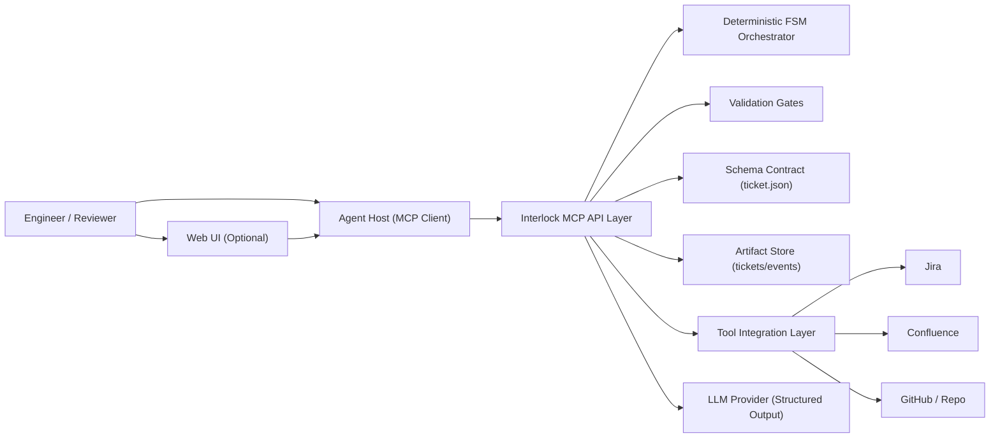
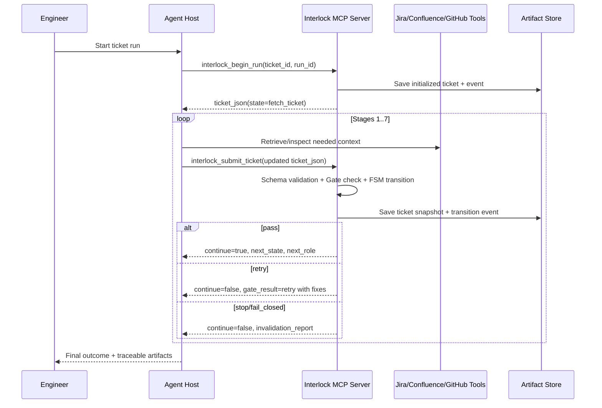

# Interlock: High Level Design

Team: Interlock Workshop Team  
Members: Yonatan Csasznik

## 1. Document Scope (PRD + HLD)

This document combines:
- Product Requirements Document (PRD): what Interlock must deliver and how success is measured.
- High-Level Design (HLD): how Interlock is structured technically and how users interact with it.

Interlock is an MCP server that governs AI ticket-resolution workflows with a deterministic finite-state process, schema validation, evidence grounding, and traceable artifacts.

## 2. Problem Statement

AI-assisted ticket resolution often fails due to state drift, weak traceability, and non-deterministic behavior.  
Interlock addresses this by enforcing strict stage contracts, validation gates, and fail-closed workflow control.

## 3. Product Goals and Non-Goals

### Goals
- Ensure deterministic run progression across a fixed workflow.
- Enforce structured ticket contract (`ticket.json`) at every step.
- Require evidence-linked outputs before advancement.
- Provide full traceability via persisted artifacts and events.
- Reduce wasted tool/LLM calls using fail-fast validation.

### Non-Goals
- Replacing Jira/Confluence/GitHub as systems of record.
- Fully autonomous code merge/deploy without review.
- Acting as a generic chatbot for open-ended conversations.

## 4. Primary Users and Personas

- Engineer (main operator): starts and progresses run state by submitting updated `ticket.json`.
- Team Lead / Reviewer: inspects plans, evidence, invalidation reasons, and final outcome.
- Platform/AI Engineer: maintains workflow rules, schemas, and operational reliability.

## 5. What are the system's main components?

### Main components (high-level)
- MCP API Layer: exposes tools such as `interlock_begin_run` and `interlock_submit_ticket`.
- FSM Orchestrator: controls allowed state transitions.
- Validation Gate Engine: validates payloads and decides `pass` / `retry` / `stop`.
- Schema Contract Layer: strict Pydantic envelope for ticket lifecycle.
- Artifact Store: persists ticket snapshots and events.
- Tool Integration Layer: Jira/Confluence/GitHub/repo connectors (via MCP/tool adapters).
- Optional UI Dashboard: visibility into runs, gates, history, and outcomes.

### Components diagram (squares + arrows)



## 6. How will the main users' use cases look alike?

### Main use case: Resolve a Jira ticket with governed AI flow

1. Engineer starts a run with `interlock_begin_run`.
2. Interlock returns canonical `ticket.json` in `fetch_ticket` stage.
3. Agent collects required stage output and resubmits via `interlock_submit_ticket`.
4. Gate validates payload; FSM advances only on pass.
5. On fixable issue, Interlock returns `retry` with required fixes.
6. On blocking issue, Interlock moves to `fail_closed` with invalidation report.
7. On success, workflow reaches `complete` with persisted artifacts and final summary.

### Sequence diagram



## 7. What is the Front End (UI) technology you are aiming to use?

### Target UI stack
- Frontend: React + TypeScript (Next.js App Router preferred).
- Styling: Tailwind CSS or CSS Modules.
- Diagrams/docs rendering: Mermaid + Markdown viewer.

### UI architecture notes
- Next.js includes a Node.js server runtime (route handlers / server components), so it naturally acts as a lightweight Backend-for-Frontend (BFF).
- Core governance logic remains in the Python Interlock MCP service.
- UI/BFF communicates with Interlock over MCP-compatible bridge or internal API endpoint.

## 8. Mocks for main pages

These are intentionally high-level and non-binding.

### Page A: Runs Dashboard

```text
+----------------------------------------------------------------------------------+
| Interlock Dashboard                        [New Run] [Filters] [Search ticket]  |
+----------------------------------------------------------------------------------+
| Run ID      | Ticket    | Current State       | Gate Status   | Updated At       |
| run_24a...  | PROJ-128  | gather_evidence     | pass          | 2026-03-04 10:15 |
| run_93f...  | PROJ-212  | act_via_tools       | retry         | 2026-03-04 09:58 |
| run_be1...  | PROJ-301  | fail_closed         | stop          | 2026-03-04 09:11 |
+----------------------------------------------------------------------------------+
```

### Page B: Run Details (Trace + Artifacts)

```text
+----------------------------------------------------------------------------------+
| Run: run_24a...      Ticket: PROJ-128      State: gather_evidence               |
+----------------------------------------------------------------------------------+
| Left Panel: Stage Timeline                                                         |
| [fetch_ticket] -> [extract_requirements] -> [scope_context] -> [gather_evidence] |
|                                                                                   |
| Right Panel: Current Stage Contract                                               |
| Required fields: evidence_items                                                   |
| Validation: valid                                                                  |
| Next stage fields: plan_steps                                                     |
|                                                                                   |
| Bottom: Evidence Table (source, locator, snippet) + Event Log                     |
+----------------------------------------------------------------------------------+
```

### Page C: Gate Failure / Invalidation View

```text
+----------------------------------------------------------------------------------+
| FAIL-CLOSED REPORT                                                                 |
+----------------------------------------------------------------------------------+
| Reason code: missing_required_field                                                |
| Blocking: true                                                                     |
| Missing/Invalid: payload.evidence_items                                            |
| Required next action: Provide traceable evidence snippets with source locator      |
|                                                                                   |
| [Create Follow-up Task] [Reopen with Corrections] [Export Report]                |
+----------------------------------------------------------------------------------+
```

## 9. Functional Requirements (PRD)

| ID | Requirement | Priority |
|---|---|---|
| FR-1 | System must initialize a canonical run ticket via `interlock_begin_run`. | Must |
| FR-2 | System must validate submitted `ticket.json` against strict schema. | Must |
| FR-3 | System must enforce deterministic stage transitions only. | Must |
| FR-4 | System must return structured gate outcomes (`pass`/`retry`/`stop`). | Must |
| FR-5 | System must fail closed for blocking violations with invalidation report. | Must |
| FR-6 | System must persist ticket snapshots and events for every submission. | Must |
| FR-7 | System should expose run history and gate outcomes in a UI dashboard. | Should |
| FR-8 | System should support integrations with Jira, Confluence, and GitHub tools. | Should |

## 10. Non-Functional Requirements

| Category | Requirement |
|---|---|
| Reliability | No state skipping; deterministic transitions from server authority only. |
| Traceability | Every major decision/output must be linked to persisted history/evidence. |
| Security | Credentials managed via environment/secret store; no secrets persisted in artifacts. |
| Performance | Typical stage transition response under 2s excluding external tool latency. |
| Scalability | Stateless server + append-only artifact storage enables horizontal scaling. |
| Maintainability | Stage contracts and schemas versioned; tests required for each stage change. |

## 11. Data Model and Storage

### Core entities
- `Ticket`: run-level envelope (`run_id`, `ticket_id`, `state`, `payload`, validation, history).
- `HistoryEntry`: transition and validation events over time.
- `ValidationStatus` and `InvalidationReport`: governance outcome records.
- `Event Log`: append-only records in artifact storage.

### Storage approach
- Current PoC: JSONL append-only files in `interlock_data/`.
- Future option: SQLite/PostgreSQL for queryability and retention policies.

## 12. Integration Strategy

- API style: MCP tools for run lifecycle operations.
- External systems: Jira, Confluence, GitHub, and repository tools through integration layer.
- Communication contract: structured JSON payloads with strict schema validation.
- Integration principle: treat all external data as untrusted until validated and normalized.

## 13. Security Measures

- Strict input validation (schema + stage payload checks).
- Least-privilege API tokens for external systems.
- Redaction policy for sensitive data in logs/artifacts.
- Explicit fail-closed behavior for invalid or unverifiable claims.

## 14. Scalability and Performance

- Keep ticket payloads minimal by stage to limit token/tool overhead.
- Cache immutable lookup data where possible (ticket metadata, source IDs).
- Separate control-plane logic from external I/O paths.
- Add async queue workers for high-volume tool operations if usage grows.

## 15. Error Handling and Recovery

- `retry` path for fixable validation failures with explicit fix instructions.
- `stop` + `fail_closed` for blocking errors.
- Bounded retry strategy to avoid runaway loops.
- Checkpoint history enables audit and controlled recovery on next run.

## 16. Deployment Strategy

- Dev/Workshop: local Python service + local artifact storage.
- Team environment: containerized Interlock service (Docker) with managed secrets.
- Production target: stateless service instances + persistent managed database/object store.
- CI/CD: run lint/tests before deploy; promote via staged environments.

## 17. Testing and Quality Assurance

- Unit tests: FSM transitions, gates, schema validation.
- Contract tests: MCP tool response envelopes.
- Integration tests: end-to-end run across all main stages.
- Regression tests: known fail-closed and retry cases.

## 18. Performance Metrics and Monitoring

### Key metrics (KPIs)
- Pass/retry/stop ratio per stage.
- Average transitions per successful run.
- Time to complete run.
- Fail-closed rate by reason code.
- Coverage ratio: requirements mapped to evidence/plan steps.

### Monitoring
- Structured logs with `run_id` correlation.
- Dashboard for active runs and failure reasons.
- Alerting on repeated blocking reason codes or error spikes.

## 19. Regulatory and Compliance Considerations

- Respect organizational data access policies for Jira/Confluence/GitHub.
- Avoid persisting credentials or personal sensitive data in artifacts.
- Maintain immutable audit trail for change accountability.

## 20. Dependencies and External Services

- Python 3.11+
- FastMCP
- Pydantic v2
- Jira/Confluence/GitHub APIs (or MCP wrappers)
- Optional UI stack: Next.js + React + TypeScript

## 21. Milestones (High-Level)

1. PoC governance flow (deterministic FSM + schema + gates).
2. Full tool integrations and richer evidence checks.
3. UI dashboard for run visibility and invalidation triage.
4. Production hardening (auth, monitoring, managed storage, SLOs).

## 22. Open Items

- Confirm final team name and full member list for submission header.
- Decide whether the UI is in PoC scope or post-PoC milestone.
- Confirm preferred persistence backend beyond JSONL for team deployments.
